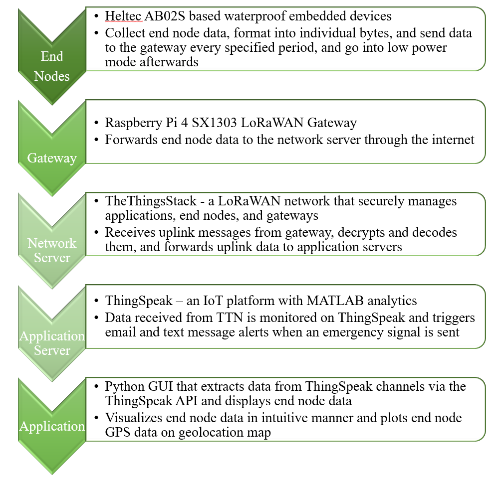

<!-- PROJECT LOGO -->
<br />
<p align="center">
  <a href="https://github.com/williamlorenzen/LoRaWAN-Team">
    
  </a>

  <h2 align="center" style="font-size: 48px;">LoRaWAN Asset Tracker and Emergency Button</h2>

  <p align="center" style="font-size: 32px;">
    <strong>Spring 2024 LoRaWAN Team</strong>
    <br />
    William Lorenzen, Maria Barrera, Justin Nagovskiy
  </p>
</p>

<!-- TABLE OF CONTENTS -->
<details open="open">
  <summary>Table of Contents</summary>

## Table of Contents
- [Background](#background)
  - [LoRaWAN Overview](#lorawan-overview)
  - [Problem Overview](#problem-overview)
  - [LoRaWAN as a Solution](#lorawan-as-a-solution)
- [System Architecture](#system-architecture)
- [TheThingsNetwork](#thethingsnetwork)
  - [TTN Background](#ttn-background)
  - [TTN Applications](#ttn-applications)
  - [End Device Registration](#end-device-registration)
- [ThingSpeak](#thingspeak)
  - [ThingSpeak Account Creation](#thingspeak-account-creation)
  - [ThingSpeak Visualizations and Reacts](#thingspeak-visualizations-and-reacts)
  - [ThingSpeak Account Setup](#thingspeak-account-setup)
  - [Text Message Notification Setup](#text-message-notification-setup)
- [Gateway](#gateway)
  - [Option 1](#option-1)
  - [Option 2](#option-2)
- [Operation](#operation)
  - [End Node](#end-node)
  - [GPS Operation](#gps-operation)
  - [Bluetooth Uplink Communication](#bluetooth-uplink-communication)
  - [Downlink Communication](#downlink-communication)
  - [Farm Communication System and Future Work](#farm-communication-system-and-future-work)
  - [Python GUI](#python-gui)
- [Authors](#authors)
- [Acknowledgements](#acknowledgements)
</details>

<!-- Background -->
## Background

### LoRaWAN Overview

<p align="center">
	
</p>

LoRaWAN (Long Range Wide Area Network) is a networking protocol specially designed for low power, wide area applications. Introduced in the mid-2010s, LoRaWAN is known for its lower power consumption, cost-effectiveness, and longer range compared to traditional WiFi and cellular communications. However, it features lower bandwidth, which restricts its use for real-time, high data transfer applications. This makes LoRaWAN particularly well-suited for agricultural applications, where its long range and low power consumption are ideal for monitoring and reporting across extensive areas without requiring frequent battery recharges/replacements. To learn more about LoRaWAN, refer to [TheThingsNetwork's documentation](https://www.thethingsnetwork.org/docs/lorawan/).

### Problem Overview

The agricultural sector is recognized as one of the most hazardous industries in the United States, with a notable fatality rate of [23.5 per 100,000 workers](https://www.bls.gov/news.release/cfoi.nr0.htm). Two primary challenges complicate safety measures in this sector:

1. Asset Management: The extensive use of equipment and vast expanses of farmland make it difficult to monitor and manage assets effectively. Loss and misplacement of equipment are common issues, often highlighted during inventory checks.

2. Connectivity and Safety: Unreliable Wi-Fi and cellular connections in rural areas severely impact the implementation of safety measures. This connectivity gap poses a significant risk to worker safety, potentially leaving individuals isolated and unable to call for help during emergencies.

### LoRaWAN as a Solution

Given the limitations of conventional wireless communications like cellular and WiFi—namely their high cost and inadequate coverage in rural settings—LoRaWAN presents a viable alternative. Its low-cost, long-range capabilities allow for communication up to tens of kilometers in open conditions, addressing critical issues within the agricultural industry. 

To confront the safety and security concerns in the agricultural sector, our group developed a LoRaWAN-based end node that works as a personal emergency button as well as an asset tracker. Containing a GPS module, the end node collects its real time GPS coordinates and sends it in uplink messages to the server, along with other end node data, including the emergency status of the device, the battery voltage, and unique message codes that can be sent by field workers. Additionally, a Python application was created that will allow farm managers to view the real time GPS locations of the end nodes on a geolocation map, as well as the rest of the end node data. To ensure quick responses to emergencies, we have configured the server to send email and text notifications to relevant parties whenever the emergency button on the end node has been pressed. 

<!-- System Architecture -->
## System Architecture

<p align="center">
	
</p>

Our system architecture is comprised of of five primary components: the end nodes, the gateway, TheThingsNetwork, ThingSpeak, and a Python GUI. Please note that we refer to TheThingsStack, our network server, as TheThingsNetwork (TTN) in our documentation.

1. The end nodes are waterproof devices that are based around the [HTCC-AB02S](https://heltec.org/project/htcc-ab02s/), a development board that supports LoRaWAN communication and contains an Air530Z GPS and OLED display, making it optimal for our application. Please refer to the [hardware](hardware/) and [heltec_software](heltec_software/) folders, which each contain their own README files, for more information about the design of the end node.

2. The gateway is an SX1303 Raspberry Pi LoRaWAN gateway that was built and configured on TTN by the Fall 2023 LoRaWAN team. Additional information about the gateway and the instructions that the previous team used to set it up can be found [here](https://www.waveshare.com/wiki/SX1302_LoRaWAN_Gateway_HAT). If you want to learn how to set up a new gateway and configure it on TTN, refer to the [TTN documentation](https://www.thethingsindustries.com/docs/gateways/models/). The gateway is discussed in greater detail in the [Gateway section](#gateway).

3. TTN is our network server, where all of the uplink messages that are forwarded by the gateway are received, decoded, and forwarded to ThingSpeak. TTN is discussed in greater detail in the [TheThingsNetwork section](#thethingsnetwork).

4. ThingSpeak is our application server, where the data received from TTN is displayed and processed, allowing alerts to be triggered when an emergency signal is sent by an end node. Originally, we intended for ThingSpeak to act as the platform on which farm managers could view end node data and GPS locations, but due to limitations that are described in our report, we decided to develop a Python GUI to serve this purpose instead. The [ThingSpeak API](https://thingspeak.readthedocs.io/en/latest/api.html) allowed us to extract our end node data from ThingSpeak and use it in our GUI. ThingSpeak is discussed in greater detail in the [ThingSpeak section](#thingspeak) and [thingspeak_code](thingspeak_code/) folder.

5. The Python GUI extracts data from ThingSpeak, generating a fully interactive map displaying various end node locations and paths, as well as presenting end node data such as emergency status, battery charge, messages, and time since the last uplink message was received, all within a single interface. Please refer to the [gui_software](gui_software/) folder, which contains its own README file, for more information about the Python GUI.

<!-- Operation -->
## TheThingsNetwork

### TTN Background 

TTN is the backbone of our system, with it receiving the uplink messages from our end nodes, decrypting and decoding the data, and forwarding the properly formatted data to ThingSpeak. TTN can also schedule downlink messages to particular end nodes, which we have implemented functionality for on our devices. 

On TTN, the gateway and end nodes must be configured appropriately in order to facilitate LoRaWAN communication. The LoRaWAN and Sentinel teams are using a shared TTN account for their implementations, on which the SX1303 gateway has already been configured. Future team members can reach out to [William](#authors) for the login information. As the gateway has already been configured on this shared account, configuration of the gateway on TTN will not be explained. TTN can be accessed [here](https://nam1.cloud.thethings.network/console/applications).

### TTN Applications

The important part of TTN for building upon our project or implementing other LoRaWAN based applications is the "Applications" tab. It is here that end devices are configured, which in our case is the HTCC-AB02S. We have designed our system so that each end node is configured in in its own unique application. This is because our TTN applications are configured to send decoded data to ThingSpeak, which then appears on ThingSpeak channels. The problem with these ThingSpeak channels is that there is a maximum of eight data fields per channel, meaning that a single ThingSpeak channel would not be able to handle the end node data of even two of our end nodes. Additionally, a single TTN application cannot be configured to send data from different end devices to separate ThingSpeak channels to circumvent the channel field limit. 

Therefore, we decided that our system would implement a dedicated TTN application for each of its end nodes, with each dedicated application sending end node data to a dedicated ThingSpeak channel. This way, each device was able to send eight fields of data to ThingSpeak, which was sufficient for our project and will allow future teams the bandwidth to send additional data from our end nodes, such as agricultural sensor data.

Establishing connection between TTN and ThingSpeak includes creating a webhook to a ThingSpeak channel from a TTN application. This process is explained in this [video](https://www.youtube.com/watch?v=b9Ga4nwnsTM).

### End Device Registration

The next step is to register an end device in an application. To do so: 

1. Click "Register end device" inside the relevant application.

2. Fill in the below information for the AB02S:

<p align="center">
	
</p>

Depending on what brand or model that you use, the information may need to be different. But make sure you select your model with (Class A - OTAA), as is done in the image above. This is because end devices should be configured as Class A to reduce power draw, and OTAA communication should be used because it is more secure than ABP. More on [LoRaWAN classes](https://www.thethingsnetwork.org/docs/lorawan/classes/) and [communication types](https://www.thethingsnetwork.org/forum/t/what-is-the-difference-between-otaa-and-abp-devices/2723).

3. Input all 0's for the JoinEUI

4. Have TTN Generate the DevEUI and AppKey for you.

5. Go to your end node's script and update the DevEUI and AppKey to reflect the TTN generated information. For our project, this means going to the [GPS_LoRa script](heltec_software/GPS_LoRa/GPS_LoRa.ino) and updating the devEUI and appKEY arrays.

6. Click "Register end device." Your end device is now configured on TTN.

7. Click on the registered device and select "Payload Formatters."

8. For "Formatter type," select "Custom Javascript formatter."

9. Input your custom payload formatter, which decodes the payload that has been received from the end device. This should be tailored to the way in which you prepare your payload on your end node device. For our project, our TTN payload formatter was created according to how we filled the "appData" buffer in our GPS_LoRa.ino script. See the [heltec_software README](heltec_software/README.md) and [GPS_LoRA.ino script](heltec_software/GPS_LoRa/GPS_LoRa.ino) for more information. Our TTN payload formatter is below:

```
function Decoder(bytes) {
  // Decode an uplink message from a buffer
  var decoded = {};

  // Decode longitude
  var lng_frac_part = (bytes[0] | (bytes[1] << 8) | bytes[2] << 16);
  var lng_int_part = (bytes[3]);
  if (bytes[4] === 0xFF ){ //field 1
    decoded.lng = -1 * (lng_int_part + lng_frac_part / 1e6);
  } else {
    decoded.lng = (lng_int_part + lng_frac_part / 1e6);
  }
  
  // Decode latitude
  var lat_frac_part = (bytes[5] | (bytes[6] << 8) | bytes[7] << 16);
  var lat_int_part = (bytes[8]);
  if (bytes[9] === 0xFF ){ // field 2
    decoded.lat = -1 * (lat_int_part + lat_frac_part / 1e6);
  } else {
    decoded.lat = (lat_int_part + lat_frac_part / 1e6);
  }
  // button state
  if (bytes[10] === 0x00){
    decoded.button = 0; //not pressed
  } else if (bytes[10] == 0xFF){
    decoded.button = 1; //pressed
  }
  
  var bat_vol = (bytes[11] | bytes[12] << 8);
  decoded.bat = (bat_vol / 1e3);
  
  var message_code = bytes[13];
  decoded.message = message_code;

  //return decoded;
  return {
  field1: decoded.lng,
  field2: decoded.lat,
  field3: decoded.button,
  field4: decoded.bat,
  field5: decoded.message
  };
}
```

The combination of a ThingSpeak webhook and the returning of fields in the payload formatter ensures that data is sent to the ThingSpeak channel that is specified in the TTN "Integrations" tab. In our payload formatter, the longitude of the end node is sent to a ThingSpeak channel's field 1, the latitude is sent to field 2, the emergency status is sent to field 3, the battery voltage (V) is sent to field 4, and the message code is sent to field 5. These fields then show up on the ThingSpeak channel, as seen in the figures below.

<p align="center">
	
</p>

<p align="center">
	
</p>

With that, an end node can be been configured on TTN. When a new end node is being added to the system, a new application will have to be created, the end device registered, the relevant Javascript formatter code pasted into the payload formatter, a new ThingSpeak channel created, and the webhook to the new channel established.

<!-- ThingSpeak -->
## ThingSpeak

### ThingSpeak Account Creation

ThingSpeak is our application server where the data from TTN is sent and displayed, the emergency status flag is monitored, and an alert is sent to the email associated with the ThingSpeak account if the emergency flag is set to "1". There is no shared ThingSpeak account for LoRaWAN or Sentinel teams, so future teams will need to create a new MathWorks account (as ThingSpeak is a MathWorks service) for their project. The new MathWorks account should be created with a gmail account, not a UF email account. 

This is because you must configure forwarding rules on the email associated with the MathWorks account so that when a ThingSpeak alert is received, the email is forwarded to any relevant phone numbers. We found that UF emails do not allow for automatic forwarding of emails to members outside of the organization, so gmail must be used so that the alerts can be properly sent via text. If you want to access to the [Spring 2024 ThingSpeak account](https://thingspeak.com/login) to see our implementation, please reach out to [William](#authors).

### ThingSpeak Visualizations and Reacts

ThingSpeak is an IoT analytics platform that allows for analysis, visualization, and reacts through MATLAB. There is great documentation for it, which can be found [here](https://thingspeak.com/pages/how_to). Originally, we planned for ThingSpeak to be used by agricultural managers to view end node data and current locations, but due to every device needing to be on a different ThingSpeak channel and MATLAB visualizations being very small and non-interactive, we decided that a [Python GUI](gui_software) would serve this purpose instead. The limitations of ThingSpeak visualizations for our project can be seen in the small, low resolution output below. More on this visualization's source code is [here](thingspeak_code/).

<p align="center">
	
</p>

Therefore, ThingSpeak is primarily being used in our project to host Reacts, which trigger preconfigured actions whenever a ThingSpeak channel meets a certain condition. We have configured Reacts for each channel associated with our systems devices such that the first time that field 3, associated with the emergency flag, switches from 0 to 1, an email is sent to the gmail associated with the ThingSpeak account, with the email containing the current GPS coordinates of the end node that sent the emergency signal. To better understand Reacts, refer to the [MathWorks documentation](https://www.mathworks.com/help/thingspeak/act-on-your-data.html). For reference, below is the react that was created for William's device:

<p align="center">
	
</p>

This react ensures that when field 3 of channel 2496188 becomes "1", the ["Send Alert"](thingspeak_code/Send_Alert.txt) code is run. The Send Alert code then reads the fields associated with each emergency flag on the devices, and if a particular flag is equal to 1, a corresponding email alert is sent. It should be noted that the free version of ThingSpeak limits users to two ThingSpeak email alerts every 30 minutes. There is more on the Send Alert code and the "Boundary Flag" in the [ThingSpeak folder README](thingspeak_code/).

### ThingSpeak Account Setup

To fully set up your ThingSpeak account so that it fits with our system architecture, all that needs to be done is:

1. Create a new [ThingSpeak channel](https://thingspeak.com/channels) for each end node device. 

2. Under "Sharing," click "Share channel view with everyone." This makes the channel Public and will allow the Python GUI to extract data from the channel using the ThingSpeak API.

3. In TTN, alter each application webhook according to the new ThingSpeak channel IDs and Write API Keys associated with each end node.

4. Manually create Reacts for each ThingSpeak channel, with each of them triggering the "Send Alert" code.

5. Create a new MATLAB Analysis called "Send Alert" and paste [our code](thingspeak_code/Send_Alert.txt) into it.

6. Edit the channel IDs and Read API Keys in the Send Alert code to match with the new channels.

With that, your ThingSpeak account is fully set up and can easily be edited to accomodate more end nodes. Your TTN application webhooks and TTN payload formatters do the work behind the scenes to send data to the correct ThingSpeak channels, which you can view by doing "Add Visualization" for every field on your ThingSpeak channels, making the channel look like [this](https://thingspeak.com/channels/2496188).

It should be noted that the free version of ThingSpeak is limited to four channels. You can register for other [licenses](https://thingspeak.com/prices) to increase the number of channels. Or each team member could utilize a free membership, set up their accounts following the previously described steps, and have their TTN applications send to channels associated with the different accounts.
 
### Text Message Notification Setup

With your ThingSpeak account set up, ThingSpeak will send you an email like the one below whenever an emergency signal is received.

<p align="center">
	
</p>

We want this email to be automatically fowarded to relevant phone numbers via text, which will better facilitate an emergency repsonse. To do so, follow the steps in [this tutorial](https://www.instructables.com/Get-Gmail-To-Text-Emails-To-Your-Phone/), with some slight changes: 

1. Make sure that "Forwarding" in the "Forwarding and POP/IMP" tab is set to "Disable forwarding."

2. In the "Filters and Blocked Addresses" tab, click "Create a new filter."

3. In the "From" input cell, type "thingspeak-alerts@mail.thingspeak.com"

4. Click "Create Filter"

5. Check the box next to "Forward it to:" and select the relevant cellphone email address that you set up by following the linked tutorial. 

6. Verify the phone number.

7. Follow steps 2-7 for each phone that you want the alert forwarded to.

Please note that if Verizon is your carrier, use [10-digit phone number]@vzwpix.com rather than [10-digit phone number]@vtext.com, as the @vtext.com email has a message capacity that cuts forwarded emails short.

With that, your ThingSpeak account and text message alerts will be fully set up and you can receive alerts like the one below:

<p align="center">
	
</p>

<!-- Gateway -->
## Gateway

<p align="center">
	
</p>

The SX1303 Raspberry Pi gateway has already been fully setup and initialized on TTN. To connect the end nodes to TTN, the gateway needs to be connected to the server as well, which is done by powering up the gateway and running its packet forwarder. 

There are two options for connecting the gateway to the server:
1. SSHing in
2. Starting the packet forwarder directly on the Raspberry Pi


### Option 1:
1. Connect the gateway and your computer to the same WiFi network. You cannot use eduroam on the gateway, so you will either need to use your hotspot, or connect to the wifi that Dr.Eisenstadt has setup in NEB212. If you are using your hotspot, the gateway will not automatically join the first time, so you will need to directly startup the Raspberry Pi and connect to your WiFi hotspot manually, like in Option 2, so that the gateway knows your hotspot. Upon future bootups, the gateway will automatically connect to your hotspot.
2. Once the gateway and your computer are on the same Wifi, open up "command prompt" on your computer.
3. Paste:
	```
	ssh lora23@raspberrypi
	```
4. When prompted for the password, enter:
	```
	IoT4Ag
	```
5. When you have connected to the gateway, paste the following lines separately:
	```
	cd ~
	```
	```
	cd ~/sx1302_hal/
	```
	```
	cd packet_forwarder
	```
	```
	sudo ./lora_pkt_fwd -c test_conf
	```

### Option 2:
1. Connect an HDMI connector to the gateway and a monitor. Connect a mouse and keybord to the gateway.
2. Manually connect to your hotspot or other WiFi (not eduroam) on the Raspberry Pi.
3. Open up command prompt on the Raspberry Pi.
4. When you have connected to the WiFi, paste the following lines separately:
	```
	cd ~
	```
	```
	cd ~/sx1302_hal/
	```
	```
	cd packet_forwarder
	```
	```
	sudo ./lora_pkt_fwd -c test_conf
	```

The packet forwarder will now be running. You should see an error relating to the GPS on the gateway being constantly output to the command prompt. This is expected. When you look at the "Gateways" tab on TTN while signed into the shared account, you should see that the "waveshare-sx1303-eedesign2" gateway has its status listed as "Connected." 

The gateway needs to be connected to WiFi at all times to communicate with the server and receive information from the end nodes.

<!-- Operation -->
## Operation

This project has two primary end users: 

1. Agricultural workers who interact with the [end nodes](hardware/)
2. Agricultural managers who interact with the [Python GUI](gui_software/)

Each of these components have numerous use cases and were designed to be user friendly.


### End Node

The end node can be powered on by pressing the power switch - a round rocker switch embedded in the device's waterproof enclosure. The green status LED will turn on to indicate that the device is powered. The end user can then interact with the device by using the three buttons that are also embedded in the side of the enclosure. These buttons are:

- Emergency Button (red) - used to send emergency signal to server, which triggers email and text notifications so that help can be called

- Select Button (blue) - used to turn the Bluetooth communication module on/off

- Toggle Button (green) - used to toggle the OLED display on/off

<p align="center">
	
</p>

The **Toggle Button** can be pressed once to make the current longitude, latitude, and battery voltage (mV) of the end node appear on the OLED display. When the toggle button is pressed again, the OLED display will be cleared and turned off.

The **Select Button** can be pressed once to turn Bluetooth communication on, which results in a corresponding message being displayed on the OLED. When the Select button is pressed again, Bluetooth communication is turned off and, again, a corresponding message is displayed on the OLED. Bluetooth communication with the end node is discussed more in the [Bluetooth Communication](#bluetooth-uplink-communication) section of this README.

The **Emergency Button** can be held down once to trigger a message on the OLED display asking the user if they want to send an emergency signal. If they do, they can hold down the emergency button once again, and the emergency signal will be sent in the next uplink message to the server. A message then appears on the OLED stating that the emergency signal has been sent. 

If the emergency button was accidentally held down once and it is not held down again within a 10 second window, then the OLED message will be cleared, and the emergency button will once again have to be held down twice to send an emergency signal. This protects against an emergency signal accidentally being sent, which triggers email and text notifications and could cause first responders to be called unnecessarily.

A video of the end node button's functionalities can be found [here](https://www.youtube.com/watch?v=o7ewifo6IbQ&t=4s). A video of the emergency button functionality and its interaction with TTN, ThingSpeak, and the Python GUI can be found [here](https://www.youtube.com/watch?v=NjQwIZdp0Hk&t=1s).


### GPS Operation

The device is programmed to start the GPS upon bootup, but it can take some time for the GPS to fix onto the four satellites required for the longitude and latitude to be determined. When the GPS has fixed, a green LED on the HTCC-AB02S starts to flash and the OLED displays the time that it took for the GPS to fix. The GPS remains fixed whilst the Heltec is in low power mode between uplink messages, meaning that the GPS has to only fix once upon bootup and after every time that Bluetooth communication is initiated and stopped (which is not expected to be frequent). 

A video of the end node's GPS fixing and real time GPS data being sent to TTN, ThingSpeak, and the Python GUI can be found [here](https://www.youtube.com/watch?v=rXeL1cVMSls&t=5s). Emergency button functionality was once again demonstrated in this video. 


### Bluetooth Uplink Communication

The end node contains an [Adafruit Bluetooth Low Energy module](https://www.adafruit.com/product/2633#description), which will allow field workers to transmit unique messages to the server using their phones. The BLE module was chosen both because of its Arduino support and because it has a dedicated iOS app that will allow users to easily interface with it. To establish Bluetooth connection and send messages to the server, the end user need only:

1. Open up their iPhone and download the [BluefruitConnect](https://play.google.com/store/apps/details?id=com.adafruit.bluefruit.le.connect&hl=en_US&gl=US) app from the App Store.

2. Press the Select (blue for BLE) Button on the end node. The OLED will display: "Turning on BluetoothLE".

2. Open up the app and make sure that the "Must have UART Service" setting is turned on to filter out extraneous Bluetooth connections. 

3. Connect to the relevant Bluetooth connection, which has its name configured by the NEW_BLE_NAME macro in our [Heltec code](heltec_software/GPS_LoRa/GPS_LoRa.ino). When their phone has connected to the BLE, a blue LED will light up on the BLE module.

4. Select UART, which will open up a chat interface.

5. Type into the text input field one of the 7 code words corresponding to a particular uplink message that will be sent to the server. These code words are preconfigured in the GPS_LoRa.ion script and can be easily changed or added to by future teams: 

| Code Received | Corresponding Message  |
|---------------|------------------------|
| `complete`    | Task complete          |
| `start`       | Starting Task          |
| `hand`        | Need a hand            |
| `repair`      | Repair Needed          |
| `pest`        | Pest Sighting          |
| `malf`        | Equipment Malfunction  |
| `deliv`       | Deliveries Arrived     |

6. View the corresponding message being displayed on the end node's OLED. For example, if "hand" is sent by the end user, the OLED will display "Going to send: Need a hand". The message can be changed to a different one before the message code is sent to the server.

7. Either submit the message "send" to the app's chat interface or press the Select (BLE) button on the end node again. This will turn off BLE communication, reinitialize LoRaWAN connection with the server, and send the message to the server in the next uplink, where it can be viewed on the Python GUI. 

8. To send another message, the end user will need to turn the BLE module back on and reconnect through the app again.

A video of the Bluetooth connection, interfacing, and the resulting messages on the Python GUI can be found [here](https://www.youtube.com/watch?v=-xSc22rfDIg&t=1s).

An added feature of the BLE module is that although the end user must turn BLE communication on and off in order to interface with the device, the module is always connected to the end node's power supply, meaning that the BLE constantly beacons while the end node is turned on. This can allow agricultural workers to detect when they are near particular assets by monitoring the names of the Bluetooth beacons that appear in the BluefruitConnect App, which can make it easier for them to check that asset off as being in inventory. 

<p align="center">
	
</p>

For example, an end node programmed to be mounted on "Tractor 321" could have the name of its Bluetooth beacon changed to "Tractor 321" using the NEW_BLE_NAME macro in our GPS_LoRa code. Then, when farm workers are doing inventory, they can walk around the general area where the end node attached to "Tractor 321" was seen on the the Python GUI, open the BluefruitConnect app and view the "Tractor 321" bluetooth beacon, and mark "Tractor 321" as being in inventory.

### Downlink Communication

The end nodes also feature downlink communication, meaning that messages can be sent from the server down to individual end nodes. We have configured specific downlink codes to trigger particular messages being displayed on an end node's OLED for 10 seconds, after which the OLED is cleared. These messages can be read by nearby agricultural workers and can facilitate long range communication between field workers and managers in rural regions that do not have cellular connection. The table of preconfigured downlink codes and their corresponding OLED messages are below:

| Downlink Data (Hex) | Downlink Data (Decimal) | Corresponding OLED Message  |
|---------------------|-------------------------|-----------------------------|
| `0x1231`            | `4657`                  | Return within Bounds        |
| `0x1232`            | `4658`                  | Return to Base              |
| `0x1233`            | `4659`                  | Move to Field A             |
| `0x1234`            | `4660`                  | Move to Field B             |
| `0x1235`            | `4661`                  | Rain Expected               |
| `0x1236`            | `4662`                  | High Heat Alert             |
| `0x1237`            | `4663`                  | Return Device to Base       |

To send a downlink message, the agricultural manager need only:

1. Open up [TTN](https://nam1.cloud.thethings.network/console/applications) and log in with our shared credentials.

2. Open up the application that corresponds to the end node that they want to communicate with. 

3. Open up the application's end device.

4. Go to the "Messaging" tab and then the "Downlink" section.

5. Type in a Hex code from the above table into the "Payload" input field, ensuring that it matches with the corresponding message that they want displayed on the end node's OLED.

6. Check the box next to "Confirmed downlink"

7. Click "Schedule Downlink" 

We are using Class A devices, meaning that after every uplink message, there are two short windows in which downlink messages can be received by the end node. So, after the downlink is scheduled and after the next uplink message is sent by the respective end node, the message corresponding to received hex code will be displayed on the end node's OLED for 10 seconds.

A video of the downlink message process and the corresponding OLED displays can be found [here](https://www.youtube.com/watch?v=OvLeOCoEfU0).

### Farm Communication System and Future Work

The Bluetooth uplink messages and TTN downlink messages can facilitate communication between field workers and managers via LoRaWAN in locations that do not have cellular connection. For example, a field worker could use their phone to send the code "water" to the end node, which would show up in the Python GUI as "In urgent need of water" in the corresponding device's message box. The manager could see this, identify the current GPS coordinates of that end node, and have another worker drive to the end node's location to provide the worker with water. The manager could send a downlink message corresponding to "We are on our way" to the respective end node so that the worker would know that help is coming. 

Additionally, either Bluetooth codes or downlink codes could be used to control many other future features of the end node, whether that be actuating motors or turning on additional sensors for environmental monitoring or equipment diagnostics, providing a scalable and versatile tool for agricultural management. A vibration motor could be added to the end node, which could be triggered when a downlink message is received, notifying nearby workers to look at the OLED display to see what the manager sent. 

The BLE module's VCC pin could be connected to a FET that is connected to the end node's battery and that is controlled by a GPIO pin, allowing the BLE module to be turned on and off through software. This would not only make the end node more power efficient by not having the BLE module powered at all times, but the end node could be configured so that if a particular downlink code was received, the BLE would remain on until a different downlink message code was received that told it to power off. 

This could allow a farm manager to tell particular end nodes to beacon Bluetooth signals with the names of the assets that they are attached to, which would allow a farm worker to walk around with the BluefruitConnect open on inventory day, view all the nearby beacons, and mark these assets as being in inventory, which could quicken the lengthy and tedious inventory process. Perhaps then the farm worker could connect to the BLEs of the nearby beaconing devices, send a code word corresponding to inventory ("inven"), and the corresponding device's message box would appear as being "In Inventory" in the Python GUI, which could be seen by the agricultural manager.

These are just ideas, but there are many ways in which this project can be built upon to address different agricultural challenges.


### Python GUI


The Python GUI is intended to be used by agricultural managers so that they can monitor the current locations of the end nodes, the paths that the end nodes traveled on particular days, and the rest of the end node data, including battery charge, messages, time since the last uplink was received, and emergency status. The GUI offers additional features, such as displaying polygons representing different fields on an agricultural site (allowing users to easily identify which end nodes are in which fields), automatic snapping to and plotting on the map the locations of end nodes that sent emergency signals, a feature to toggle the polygons on and off, and a feature to snap the map to the last received location of particular end nodes. 

This is best demonstrated with a [video](https://www.youtube.com/watch?v=8F29PMxJtjw).

After the GUI is opened, its fields must be manually updated by clicking "Get Latest" buttons. When this is done, there is no discernible latency between the uplink message being received by TTN, the decoded data being sent to ThingSpeak, and the data being plotted and displayed on the Python GUI. This is best demonstrated in a [video](https://www.youtube.com/watch?v=JTSg13Apyt0). 

In this video, we sent mock GPS data from an end node, making it look like it was traveling across the Quincy, FL site, which can clearly be seen in the Python GUI. Note that the GUI was somewhat laggy in the video because I had to have my computer connected to my phone's hotspot whilst being SSHed into the gateway.

<!-- Authors -->
## Authors

| Name               | Email                                                   | Phone       |
|--------------------|---------------------------------------------------------|-------------|
| William Lorenzen   | [liamv1200@gmail.com](mailto:liamv1200@gmail.com)       | 813-777-3454|
| Maria Barrera      | [maria.barrera@ufl.edu](mailto:maria.barrera@ufl.edu)   | 786-319-6846|
| Justin Nagovskiy   | [jnagovskiy@ufl.edu](mailto:jnagovskiy@ufl.edu)         | 954-258-6993|

Please contact William Lorenzen for any inquiries or issues related to the project.

Project Repository on GitHub: https://github.com/williamlorenzen/LoRaWAN-Team

<!-- Acknowledgements -->
## Acknowledgements

We would like to thank our senior design faculty sponsor, Dr. Eisenstadt, for his guidance on this IoT4Ag project. We would also like to thank Professor Stapleton for his help with hardware design and Dr. Small for his user interface suggestions.
