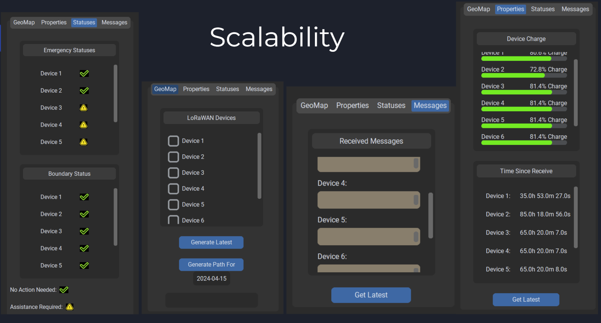

# Python GUI Application


## Dependencies

1. To run the Python GUI code, you will need jupyter notebooks, which you can access by installing [Anaconda](https://docs.anaconda.com/free/anaconda/install/windows/) and [Anaconda Navigator](https://docs.anaconda.com/free/navigator/install/).

2. Once they are installed, open up Anaconda Navigator, click on "Environments" and create a new environment with the Python package installed (the default Python 3.10.14 version is fine).

3. Open up Anaconda prompt and run: 
	```
	conda activate [name of your environment]
	```

4. Download the required packages by running:
	```
	conda install -n test jupyter
	```

	```
	pip install customtkinter
	```

	```
	pip install tkintermapview
	```

	```
	pip install thingspeak
	```

	```
	conda install numpy
	```

5. Open up jupyter notebooks in your environment by running:

	```
	jupyter notebook
	```

6. Navigate to the "LoRaWAN_GUI.ipynb" file and open it. The code is ready to be run. To ensure that there are no errors, make sure that you select "Kernel->Restart and Run All Cells" everytime that you want to reopen the GUI.

## How It Works

The Python GUI extracts data from our ThingSpeak public channels, where each channel is dedicated to a single device. The data is extracted using the [ThingSpeak API](https://thingspeak.readthedocs.io/en/latest/api.html) and custom made functions and it is then displayed in the GUI, which was created using the [CustomTkinter](https://github.com/TomSchimansky/CustomTkinter) and [TkinterMapView](https://github.com/TomSchimansky/TkinterMapView) libraries, which have very good documentation and [tutorials](https://customtkinter.tomschimansky.com/tutorial/).

The GUI was created with scalability in mind, allowing future teams to easily add additional devices to it. Doing so requires only two changes to the code:

1. Updating the "Device_Lookup" dictionary to reflect the new quantity of devices to be displayed, along with their corresponding ThingSpeak channel IDs. Of course, this necessitates creating new TTN applications and ThingSpeak channels for each additional device and configuring them accordingly (payload formatters and webhooks).
2. Updating the "values" list to reflect the new device names within the "Device_Lookup" dictionary.



The GUI code has been extensively commented so that it may be added to or used as a model for future LoRaWAN team implementations.