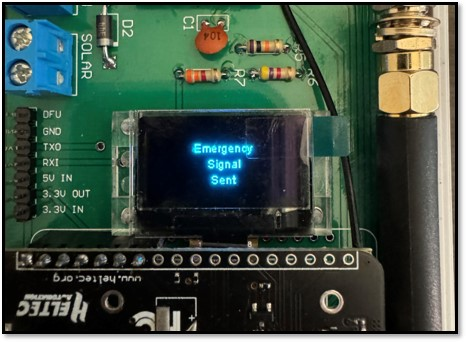

# Hardware

## System Overview

The hardware is composed of two primary subsystems: the Heltec [AB02S development board](https://heltec.org/project/htcc-ab02s/) and the [Adafruit Bluetooth Low Energy UART module](https://learn.adafruit.com/introducing-the-adafruit-bluefruit-le-uart-friend/introduction). The Heltec controls much of the system's functionality, containing the ASR650x MCU (a combination of the PSoC4000 microcontroller and the SX1262 LoRa transceiver) that dictates the end node's operation. Both modules operate on an Arduino framework, allowing for easier integration. We designed a PCB that joins these boards together and integrates the system's other peripherals, including its three buttons, status LED, female header expansion pins, and power switch. The end node is powered by a 5V Miady battery and is enclosed in a waterproof polycarbonate box.

- Power Switch - turns the end node on
- Three Buttons:
	- Emergency Button (red) - used to send emergency signal to server, which triggers email and text 	notifications so that help can be called
	- Select Button (blue) - used to turn the BLE module on/off
	- Toggle Button (green) - used to toggle the OLED display on/off
- Status LED - lights up when end node is on
- Expansion Female Headers - can be used to add external sensors or modules to the end node

## Altium Project

The PCB was designed in Altium and is in the "LoRaWAN Senior Project" folder in this repository. Additionally, a bill of materials was created. The schematic and PCB can be seen below.

	

	

A strange design choice by Heltec when designing the AB02S was to place the GPS antenna on the underside of the board, opposite the OLED display. As the AB02S's Air530Z GPS already takes quite a long time to fix, sometimes taking up to several minutes outside, we knew that having the GPS antenna pointed down into our PCB would only worsen this problem. As the OLED display is wired to the AB02S using a flexible printed circuit, we decided to unscrew the OLED from the AB02S, flip it so that it hung from the side of the development board and was pointing in the same direction as the GPS antenna, and mount the OLED to our PCB with the AB02S alongside it. This way, both the GPS antenna and OLED display were pointing towards the top of our end node.

	

## End Node

Pictures of the end node can be seen below. The emergency (red), select/BLE (blue), and toggle (green) buttons are embedded in the waterproof box.

	

	

Caulk still needs to be applied to seal the gaps between the buttons, power switch, and the enclosure to ensure waterproofing.

## Future Work

There are quite a few hardware items that future teams may consider working on to build upon this project, or at least that they can keep in mind when pursing their own:

### Miniaturization of End Node 
- our end node is very bulky, making it suitable to be mounted on large equipment like tractors, but not wearable
- there is definitely room to shrink our PCB, as SMDs can be used and there is lots of empty space on our PCB
- a concern is that the Bluetooth or LoRaWAN signals may be impeded if everything is crowded too close together

### Addition of Peripherals
- peripherals can be added to our end nodes by connecting them to the female header pins located on the edge of the board
- these peripherals can include environmental sensors, and the system can be updated to transmit the sensor readings to the server, where they can be viewed on the GUI once it is updated
- a vibration motor was discussed as a possibility in the main branch's README file

### Battery Updates
- transition from a 5V Miady battery to a 3.7V LiPo battery to power the end node will allow the end node to be more easily miniaturized, as the Miady battery is very bulky
- additionally, use of a LiPo may allow for more accurate mapping of the end node voltage to battery charge percentage

### Gateway Improvements
- a hardware improvement for the gateway is to possibly transition to using the Raspberry Pi 5 for the SX1303 Gateway to avoid the heat generated by the Raspberry Pi 4
- currently, the gateway gets incredibly hot after only a few minutes of operation, which caused us to never have it on for long periods of time and never consider having it permanently powered on in NEB212
- transition to a Raspberry Pi 5 or other LoRaWAN gateway that could always be powered on and would not have to be SSHed into whenever it was booted up would be incredibly nice for future teams

### Miscellaneous
- extensive testing in the field is required to ensure that the end node maintains charge for long periods of time
- alter the PCB so that the BLE's VCC is connected to a FET rather than the battery's 5V input, which will allow the BLE to be turned on and off by software, rather than constantly on. As mentioned in the main branch's README file, this would make the end node more power efficient
- the LoRaWAN signals would be far less prone to attenuation if the antenna could be mounted on the outide of the enclosure (and the antenna's wire is long enough to do this)

