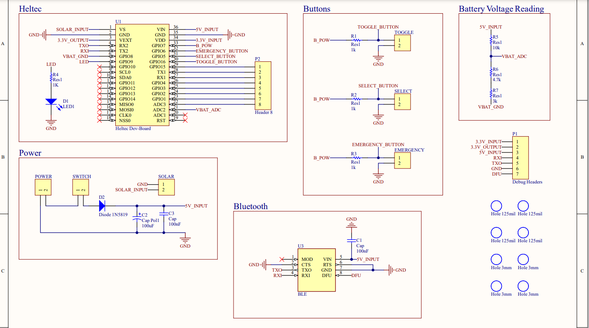
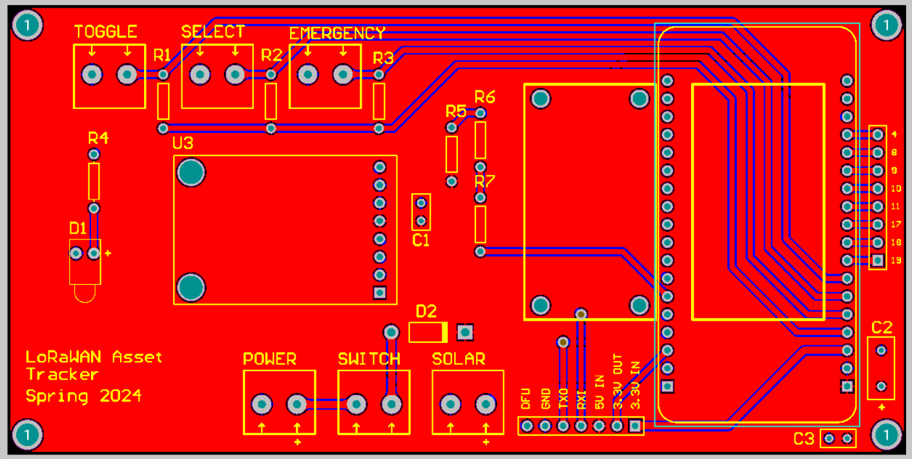
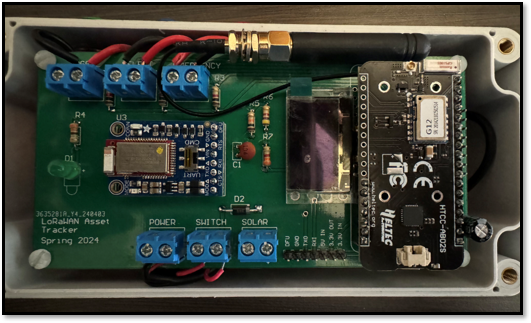
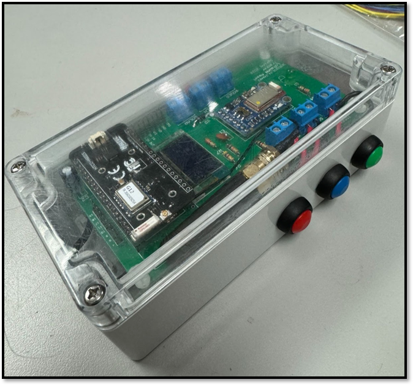

# Hardware

## System Overview

The hardware is composed of two primary subsystems: the Heltec [AB02S developmemnt board](https://heltec.org/project/htcc-ab02s/) and the [Adafruit Bluetooth Low Energy UART module](https://learn.adafruit.com/introducing-the-adafruit-bluefruit-le-uart-friend/introduction). The Heltec controls much of the system's functionality, containing the ASR650x MCU (a combination of the PSoC4000 microcontroller and the SX1262 LoRa transceiver) that dictates the end node's operation. Both modules operate on an Arduino framework, allowing for easier integration. We designed a PCB that joins these boards together and integrates the system's other peripherals, including its three buttons, status LED, female header expansion pins, and power switch. The end node is powered by a 5V Miady battery and is enclosed in a waterproof polycarbonate box.

- Power Switch - turns the end node on
- Three Buttons:
	- Emergency Button (red) - used to send emergency signal to server, which triggers email and text 	notifications so that help can be called
	- Select Button (blue) - used to turn the BLE module on/off
	- Toggle Button (green) - used to toggle the OLED display on/off
- Status LED - lights up when end node is on
- Expansion Female Headers - can be used to add external sensors or modules to the end node

## Altium Project

The PCB was designed in Altium and is in the "LoRaWAN Senior Project" folder in this repository. Additionally, a bill of materials was created. The schematic and PCB can be seen below.

	

	

## End Node

Pictures of the end node can be seen below. The emergency (red), select/BLE (blue), and toggle (green) buttons are embedded in the waterproof box.

	

	

