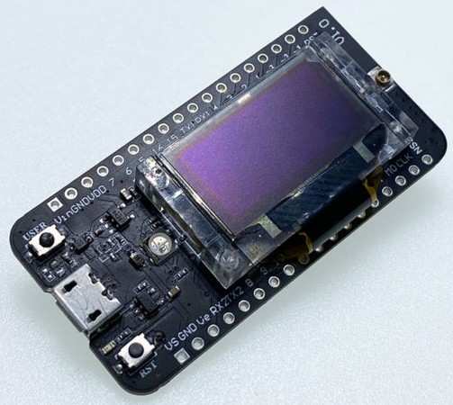

# Heltec AB02S Code

## Dependencies

	

Our end nodes are controlled by Heltec CubeCell (ASR-650X) Development Boards, specifically the [AB02S](https://resource.heltec.cn/download/CubeCell/HTCC-AB02S). Heltec has created Arduino Frameworks for their development boards that simplifies establishing LoRaWAN communication and programming additional functionalities. To program the boards:

1. Install the CubeCell framework through the [Arduino board manager](https://docs.heltec.org/en/node/asr650x/htcc_ab02s/quick_start.html).

2. Establish serial connection by installing the [USB driver](https://docs.heltec.org/general/establish_serial_connection.html).

3. Go to where the CubeCell folder was automatically downloaded in Step 1 and replace it with the CubeCell folder in this repository. For reference, my CubeCell folder was saved in this path: C:\Users\[user]\AppData\Local\Arduino15\packages\CubeCell. This step is necessary because I had to make a lot of miscellaneous changes in the framework's source files for our application.

4. Place the Adafruit_BluefruitLE_nRF51 folder in this repository into your Arduino libraries folder. For reference, my libraries folder was saved in this path: C:\Users\[user]\OneDrive\Documents\Arduino\libraries. 

5. Open the GPS_LoRa.ino file, located in the GPS_LoRa folder in this repository, locally.

6. Under "Select Board" in Arduino, select the "CubeCell-GPS（HTCC-AB02S)".

7. Ensure the correct LoRaWAN settings under "Tools," as shown below.

You are now ready to program various AB02S boards with our program and change it according to your project's goals.

## How it Works

Our code is modeled off of the LoRaWAN.ino example script provided by Heltec, with added functionality. This example script's main loop is controlled by a switch case, where each switch block corresponds to a different step in the LoRaWAN communication protocol. The DEVICE_STATE_INIT block initializes the LoRaWAN parameters, the DEVICE_STATE_JOIN block facilitates server connection, DEVICE_STATE_SEND prepares the payload of a frame and sends an uplink message to the server, DEVICE_STATE_CYCLE schedules the next packet transmission, and DEVICE_STATE_SLEEP places the Heltec into low power mode.

Upon the Heltec booting up, LoRaWAN communication will be initialized in DEVICE_STATE_INIT and the program will enter DEVICE_STATE_JOIN to attempt to join the server. If the Heltec cannot establish communication with the server in a specified period of time, the board goes into low power mode in DEVICE_STATE_SLEEP for 30 seconds, after which it attempts to join the server once again. If the Heltec establishes a connection to the server, it joins DEVICE_STATE_SEND, where desired uplink data is formatted into individual bytes, loaded into a buffer, and transmitted to the server in an uplink message. After this, DEVICE_STATE_CYCLE is entered, in which a timer is initialized with a preconfigured period (the default is 15 seconds) and the program promptly switches to DEVICE_STATE_SLEEP. In this final switch block, the device remains in low power mode until the timer initialized in the previous step overflows, prompting the timer's Interrupt Service Routine that returns the program to DEVICE_STATE_SEND so that another frame can be sent to the server after the sleep period. The program continues in this loop of sending data to the server and sleeping for a specified amount of time indefinitely. Of course, this is a simplification of the program, but it encompasses the main functionality of the LoRaWAN.ino script.

To write our end node script, we added to this example script by configuring the device to receive button inputs and trigger corresponding ISRs, display messages on the OLED, facilitate communication with the Adafruit BLE module, and collect our end node data, including longitude, latitude, emergency status, battery voltage, and message codes. Some notable parts of the code that are important to understand are:

1. The OTAA parameters need to be changed according to configurations in TheThingsNetwork (TTN) and need to be unique for every device configured on TTN.

2. The “appTxDutyCycle” variable specifies the approximate time in ms between transmissions to the server (approximate because there is a random small addition to this number to stop two devices from sending information at the same time).

3. The “prepareTxFrame” function prepares data to be sent to the server. In this function, the "appDataSize" variable is specified with the number of bytes that are going to be sent and the payload is formatted by storing individual bytes of end node data into the "appData" buffer. This payload will be decoded by a payload formatter on TTN once the uplink message is received.

The GPS_LoRa.ino script has been extensively commented so that it may be added to or used as a model for future LoRaWAN team implementations.

Something to keep in mind is that the GPS_LoRa.ino code, as well as all relevant dependencies, take up 93% of the AB02S's program storage space (122235 bytes of the 131072 maximum). I am genuinely not sure how much this may present as a limitation for building upon our script, as the LoRaWAN.ino script alone takes up about 70% of storage space. With most of the AB02S's relevant peripherals already integrated into our script, the essential dependencies required for these components are also already loaded into the program’s storage space. This effectively reduces the additional storage needed for any new peripherals that rely on these existing dependencies, which may mean may there is still some room to add to our program, such as by adding sensors or other peripherals. This storage utilization is definitely a concern for further growth though, and may necessitate the use of other MCUs, such as the Photon, which Dr. Eisensatdt has in abundance.

