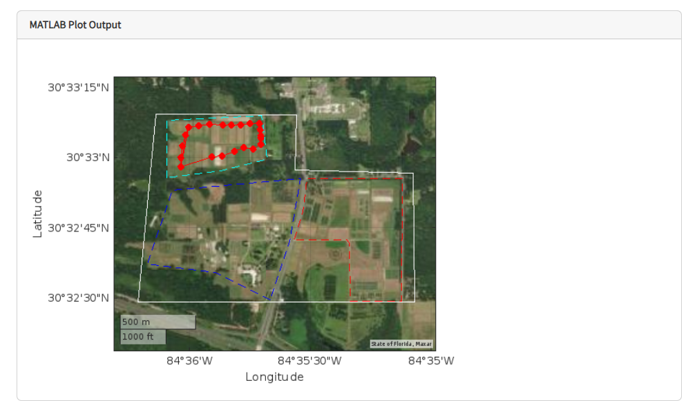
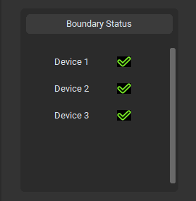

# ThingSpeak Code

## Alert

The Send_Alert file contains the code that should be pasted into a new MATLAB Analysis in ThingSpeak. After the directions are followed in the ThingSpeak section of the main branch's README, this code will be run whenever any React on the ThingSpeak account is triggered.

This code then reads the fields associated with each emergency flag on the devices, and if a particular flag is equal to 1, a corresponding email alert is sent. If the emergency flag of an end node is detected as being "1," that end node's current GPS location is extracted and included in the email alert.

## Visualization

The ThingSpeak_Plotting file contains code that can be pasted into a MATLAB Visualization. This code plots on a map all of the GPS locations that an end node sent to its respective channel on the current day. The code also plots polygons on the map that represent different fields and it counts the number of end node GPS coordinates that are located in each polygon. Originally, this code was going to serve as the tool that agricultural managers could use to view end node locations over time, but do to random display issues with the MATLAB Visualizations, the non-interactive nature of the map, and the small scale of the output, this was abandoned. However, this code can still serve to teach how to create MATLAB Visualizations in ThingSpeak if future teams wish to implement them. The display that results from this piece of code can be seen below. 

	

### Unrealized Boundary Status

An aspect of our project that was not fully realized was the “Out of Bounds” flag in ThingSpeak and in the GUI. How this operation works is there is code for every device’s ThingSpeak channel, in ThingSpeak_Plotting, that checks if the number of GPS locations recorded by an end node on the current day is within a preconfigured polygon that represents the perimeter of the site. If an end node’s GPS location is outside of this polygon, field 6 of that corresponding device’s channel is set to 1, which subsequently triggers a ThingSpeak React that sends an email notification. The Python GUI was also configured to display this Out of Bounds flag and indicate the location of the out of bounds device. 

	

This out of bounds check was done in ThingSpeak for the purpose of utilizing a React that could send notifications, however, because there are a limited number of ThingSpeak writes that can be performed in a short period of time, our implementation was ultimately unsuccessful. This ThingSpeak limitation, among the other limitations of ThingSpeak’s processing capabilities, could be circumvented by having the out of bounds check be performed in the Python GUI code. To configure a React for this out of bounds flag, exploration is needed in sending data from Python back to a specified ThingSpeak channel field by using the ThingSpeak API. 

The code that alters the boundary status flag was designed to be integrated with the ThingSpeak_Plotting code that was previously described. The boundary check is still completed within the code, but any "thingSpeakWrite" functions that alter field 6 of a channel have been commented out to avoid the MATLAB errors that result from too many writes occurring within an allotted time window. This "thingSpeakWrite" limitation may be circumvented by upgrading to another ThingSpeak license, but I do not think that thingSpeakWrite functionality is important enough to warrant the extra cost.

